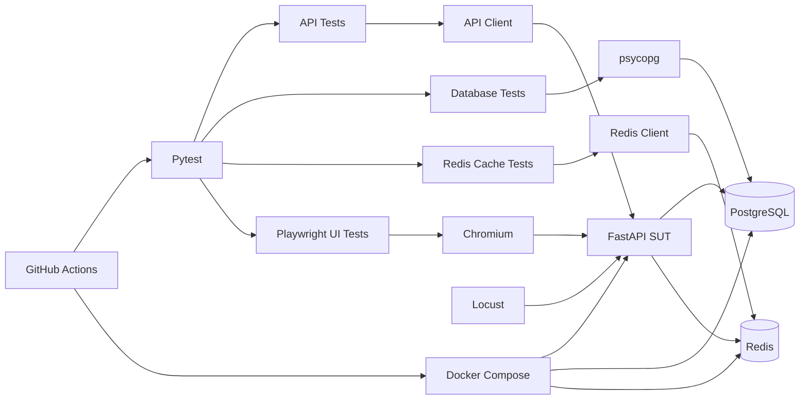
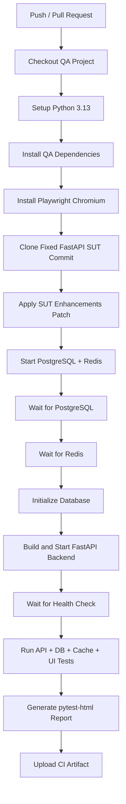

# QA Automation Testing & Performance Evaluation Platform

[](https://github.com/11166-qa/qa-automation/actions/workflows/ci.yml)

基于 **Python + Pytest + Playwright + PostgreSQL + Redis + Locust + GitHub Actions** 构建的 Web/API 自动化测试与性能评测项目，覆盖接口功能测试、数据库一致性校验、Redis 缓存验证、UI 端到端测试、分级性能压测、性能瓶颈定位与 CI 自动执行。

> **说明：** 本仓库是测试工程，不包含自研业务系统。被测系统（System Under Test, SUT）采用官方开源项目 [FastAPI Full Stack Template](https://github.com/fastapi/full-stack-fastapi-template)。本项目的工作重点是测试框架设计、测试用例实现、数据库与缓存校验、性能测试、性能问题定位及 CI 流程建设。

---

## 1. 项目概览

本项目围绕一个真实可运行的 FastAPI Web 系统，搭建完整的自动化测试链路：

- 使用 **Pytest** 组织 API、数据库、Redis Cache 和 UI 自动化测试；
- 封装 HTTP Client、数据库 Client、Redis Client 和公共 Fixture；
- 覆盖登录鉴权、Token、CRUD、边界值、异常参数、用户权限等场景；
- 使用 **psycopg** 对 PostgreSQL 数据进行直接查询，验证接口操作后的数据库一致性；
- 使用 **Redis Cache-Aside** 缓存单条 Item 查询，验证 Cache Miss、Cache Hit、TTL 及更新/删除后的缓存失效；
- 使用 **Playwright** 完成登录、创建、修改、删除、退出登录、未授权访问等 E2E 场景；
- 使用 **Locust** 构造查询、创建-查询、混合 CRUD 和 Redis 开关对照场景，完成多档并发性能测试；
- 通过后端异常栈定位 **SQLAlchemy QueuePool 连接池耗尽**问题，并完成参数调优与复测；
- 使用 **GitHub Actions** 在 Ubuntu Runner 中自动安装依赖、启动 PostgreSQL / Redis / FastAPI SUT、执行测试并上传 HTML 测试报告。

当前核心自动化用例共 **54 项**：

| 类型 | 用例数 | 主要覆盖内容 |
|---|---:|---|
| Authentication API | 12 | 登录成功/失败、缺失字段、Token、非法鉴权等 |
| Items API | 24 | CRUD、边界值、非法 UUID、权限、跨用户访问等 |
| Database | 4 | 创建、更新、删除、owner_id 一致性 |
| Redis Cache | 5 | Redis 可用性、缓存写入、命中、PUT/DELETE 失效、TTL |
| UI E2E | 9 | 登录、CRUD、退出登录、受保护路由、表单校验等 |
| **合计** | **54** | API + DB + Cache + UI |

---

## 2. 技术栈

| 类别 | 技术 |
|---|---|
| 编程语言 | Python |
| 测试框架 | Pytest |
| HTTP 测试 | requests |
| 数据库 | PostgreSQL |
| 数据库访问 | psycopg |
| 缓存 | Redis |
| Redis Client | redis-py |
| UI 自动化 | Playwright |
| 性能测试 | Locust |
| 测试报告 | pytest-html |
| 容器化 | Docker / Docker Compose |
| 持续集成 | GitHub Actions |
| 被测系统 | FastAPI Full Stack Template |

---

## 3. 项目结构

```text
qa-automation/
├── .github/
│   └── workflows/
│       └── ci.yml
│
├── configs/
│   └── config.py
│
├── performance/
│   ├── analyze_results.py
│   ├── sut_enhancements.patch
│   ├── scenario_a_get.py
│   ├── scenario_b_post_get.py
│   ├── scenario_c_mixed.py
│   ├── scenario_d_cache_get.py
│   └── results/
│       ├── A_10_stats.csv
│       ├── A_50_stats.csv
│       ├── A_100_stats.csv
│       ├── B_10_stats.csv
│       ├── B_50_stats.csv
│       ├── B_100_stats.csv
│       ├── C_10_stats.csv
│       ├── C_50_stats.csv
│       ├── C_100_stats.csv
│       ├── D_100_cache_off_nowait_stats.csv
│       ├── D_100_cache_on_nowait_stats.csv
│       ├── performance_summary.csv
│       ├── performance_endpoints.csv
│       └── performance_summary.md
│
├── tests/
│   ├── api/
│   │   ├── test_auth.py
│   │   └── test_items.py
│   ├── database/
│   │   └── test_item_db.py
│   ├── cache/
│   │   └── test_redis_cache.py
│   └── ui/
│       ├── test_auth_flow_ui.py
│       ├── test_items_ui.py
│       ├── test_login_ui.py
│       └── test_smoke_ui.py
│
├── utils/
│   ├── api_client.py
│   ├── db_client.py
│   └── redis_client.py
│
├── conftest.py
├── pytest.ini
├── requirements.txt
├── requirements-lock.txt
├── .gitignore
├── .gitattributes
└── README.md
```

---

## 4. 测试架构



测试工程和被测系统保持分离：

```text
qa-automation
    │
    ├── API / DB / Cache / UI / Performance / CI
    │
    └───────────────► FastAPI SUT
                         │
                         ├── PostgreSQL
                         └── Redis
```

这样可以避免将被测业务代码与测试工程耦合，也便于替换 SUT 或在 CI 中重新创建测试环境。

---

## 5. 配置与公共能力

### 5.1 配置管理

`configs/config.py` 支持测试环境配置，例如：

```text
BASE_URL
ADMIN_EMAIL
ADMIN_PASSWORD
REQUEST_TIMEOUT

DB_HOST
DB_PORT
DB_NAME
DB_USER
DB_PASSWORD

REDIS_HOST
REDIS_PORT
REDIS_DB
REDIS_TIMEOUT
```

默认账号仅用于本地 FastAPI 模板测试环境，不应替换为个人真实账号或生产凭据。

### 5.2 API Client

`utils/api_client.py` 对常用接口进行统一封装，包括 Login、GET Items、GET Item、POST Item、PUT Item、DELETE Item。

测试用例只关注业务输入和断言，减少重复的 URL、Header 和请求代码。

### 5.3 数据库 Client

`utils/db_client.py` 使用 `psycopg` 访问 PostgreSQL，封装 `fetch_one`、`fetch_all` 和 `execute`，用于从数据库层验证 API 操作是否真实落库。

### 5.4 Redis Client

`utils/redis_client.py` 封装测试侧 Redis 操作，包括 `ping`、`exists`、`get`、`get_json`、`set_json`、`ttl` 和 `delete`，用于验证 FastAPI 接口与 Redis 缓存状态是否一致。

### 5.5 Fixture

`conftest.py` 中通过 Fixture 管理：

- API Client；
- Admin Token / Header；
- 普通用户创建与清理；
- 测试 Item 创建与回收；
- 数据库连接；
- Redis Client；
- Playwright 登录态 Page。

通过 `yield` Fixture 实现测试前准备和测试后清理，降低测试数据相互污染。

---

## 6. API 自动化测试

### 6.1 Authentication

认证模块覆盖 12 类场景，包括正确账号密码登录、错误密码、不存在的用户、Username / Password 为空或缺失、合法 Token、缺失 Token、非法 Bearer Token、错误认证 Scheme 等。

测试过程中根据 FastAPI/Pydantic 的真实行为校正断言，例如缺失或非法请求字段返回 `422`，不为了“让用例变绿”而修改系统实际行为。

### 6.2 Items CRUD 与权限

Items API 覆盖 24 类场景，包括 Create、List、Get by ID、Update、Delete、非法 UUID、不存在的 ID、缺失/空 title、title / description 长度边界、缺失 Token、普通用户数据所有权、管理员跨用户访问及普通用户权限隔离。

---

## 7. 数据库一致性验证

仅检查 HTTP 状态码不足以证明操作真实完成，因此增加数据库层断言。

| 编号 | 场景 |
|---|---|
| DB-001 | POST 创建后直接查询 PostgreSQL，校验记录、字段和 owner_id |
| DB-002 | PUT 更新后查询数据库，校验 title / description |
| DB-003 | DELETE 后查询数据库，确认记录不存在 |
| DB-004 | 普通用户创建数据后校验 owner_id 与用户 ID 一致 |

形成：

```text
HTTP Request
    ↓
FastAPI
    ↓
PostgreSQL
    ↓
Direct SQL Validation
```

从接口层和数据层同时验证业务结果。

---

## 8. Redis Cache-Aside 验证

SUT 对：

```text
GET /api/v1/items/{id}
```

引入 Redis Cache-Aside 缓存。

核心流程：

```text
GET /items/{id}
    ↓
检查 Redis
    ├── HIT  → 返回缓存数据
    └── MISS → 查询 PostgreSQL
                  ↓
              写入 Redis
                  ↓
                返回
```

缓存 TTL 为 **300 s**。

更新和删除操作采用主动失效策略：

```text
PUT /items/{id}
    ↓
更新 PostgreSQL
    ↓
删除 item:{id} 缓存
```

```text
DELETE /items/{id}
    ↓
删除 PostgreSQL 数据
    ↓
删除 item:{id} 缓存
```

缓存访问异常采用降级策略：Redis 操作失败时记录日志，业务查询回退 PostgreSQL，避免缓存服务异常直接导致接口 500。

### 8.1 Redis 自动化测试

当前共 5 项缓存测试：

| 编号 | 场景 |
|---|---|
| CACHE-001 | Redis 服务可连接并响应 PING |
| CACHE-002 | Cache Miss 后 GET 将 Item 写入 Redis，并校验 TTL |
| CACHE-003 | 修改缓存内容后再次 GET，验证请求实际读取 Redis |
| CACHE-004 | PUT 更新后旧缓存失效，再次 GET 建立最新缓存 |
| CACHE-005 | DELETE 后缓存失效，接口再次查询返回 404 |

本地执行：

```powershell
python -m pytest tests/cache/test_redis_cache.py -v
```

---

## 9. Playwright UI E2E

Playwright 使用 Chromium 执行浏览器端测试，覆盖：

- 页面可访问性 Smoke Test；
- 管理员登录成功；
- 错误密码登录；
- 创建 Item；
- 更新 Item；
- 删除 Item；
- Logout；
- 未登录访问受保护页面时重定向；
- 前端必填字段校验。

测试中使用 `get_by_test_id`、`get_by_placeholder`、`get_by_role` 及局部 Row / Dialog 作用域，避免依赖容易变化或不唯一的文本定位器。

失败时可启用：

```powershell
python -m pytest tests/ui `
  --screenshot=only-on-failure `
  --tracing=retain-on-failure
```

用于保留截图和 Playwright Trace，辅助定位 UI 自动化失败原因。

---

## 10. Locust 性能测试设计

为了避免单一接口结果不能代表真实业务，设计四类负载场景。

### Scenario A：Authenticated GET

持续执行已认证列表查询：

```text
GET /api/v1/items/
```

认证 Token 在测试开始前统一获取，避免登录接口对纯查询场景产生干扰。

### Scenario B：Create + Get

```text
POST /api/v1/items/
        ↓
GET /api/v1/items/{id}
```

用于观察写入和随后查询的组合负载。

### Scenario C：Mixed CRUD

采用任务权重：

```text
GET  /items         5
GET  /items/{id}    2
POST /items         2
PUT  /items/{id}    1
```

即约 50% 列表查询、20% 单条查询、20% 创建、10% 更新，用于模拟以读为主、同时包含写操作的混合业务负载。

### Scenario D：Redis Cache ON / OFF 对照

针对同一：

```text
GET /api/v1/items/{id}
```

在 100 用户、相同运行时间和相同 Spawn Rate 下分别执行：

```text
CACHE_ENABLED=false
CACHE_ENABLED=true
```

同时设置：

```text
wait_time = 0
```

用于消除用户思考时间对吞吐量上限的影响，并比较 Redis 开启/关闭时的端到端性能。

Scenario A/B/C 统一进行 10 / 50 / 100 用户分级压测。正式结果使用 Locust Headless 模式运行并通过 CSV 留档，避免依赖手工截图。

---

## 11. 正式性能测试结果

以下数据来自 `performance/results/` 中正式 Headless 测试结果。

| Scenario | Users | RPS | Avg (ms) | P95 (ms) | P99 (ms) | Failure |
|---|---:|---:|---:|---:|---:|---:|
| A - Authenticated GET | 10 | 9.80 | 13.83 | 21 | 35 | 0% |
| A - Authenticated GET | 50 | 48.98 | 20.25 | 47 | 100 | 0% |
| A - Authenticated GET | 100 | **94.61** | **59.12** | **190** | **620** | **0%** |
| B - Create + Get | 10 | 19.52 | 14.38 | 28 | 41 | 0% |
| B - Create + Get | 50 | 91.72 | 44.56 | 120 | 270 | 0% |
| B - Create + Get | 100 | **118.85** | **337.66** | **530** | **790** | **0%** |
| C - Mixed CRUD | 10 | 9.72 | 16.45 | 29 | 34 | 0% |
| C - Mixed CRUD | 50 | 48.68 | 21.13 | 47 | 120 | 0% |
| C - Mixed CRUD | 100 | **88.31** | **130.84** | **420** | **910** | **0%** |

### 11.1 结果观察

- Scenario A 从 10 到 50 并发基本保持线性吞吐增长；
- 100 并发下纯查询场景保持 **P95 = 190 ms、失败率 0%**；
- Scenario B/C 在 100 并发下出现更明显的尾延迟；
- 三类正式测试在 10 / 50 / 100 并发下均保持 **0% 请求失败率**；
- 100 并发混合 CRUD 场景达到 **88.31 RPS，P95 = 420 ms**。

> 本结果来自单机 Windows + Docker Desktop 本地测试环境，仅用于该项目中的相对性能分析和瓶颈定位，不代表 FastAPI、PostgreSQL、Redis 或生产环境的通用性能上限。

### 11.2 Redis Cache ON / OFF 对照结果

100 用户、无等待时间条件下：

| 状态 | Requests | RPS | Avg (ms) | P95 (ms) | P99 (ms) | Failure |
|---|---:|---:|---:|---:|---:|---:|
| Cache OFF | 18,605 | **154.74** | **646** | **850** | **1000** | **0%** |
| Cache ON | 18,388 | **152.90** | **653** | **860** | **1000** | **0%** |

在当前测试环境和接口实现下，Redis 开启后端到端吞吐量与响应时间基本持平，并未出现明显性能提升。

该结果与接口链路有关：受保护接口在读取 Item 前仍需要完成用户鉴权和数据库访问，同时单条 Item 本身为 PostgreSQL 主键查询，查询成本较低。因此该实验主要用于验证缓存功能、稳定性及实际性能影响，而不是预设 Redis 一定带来性能收益。

详细结果：

```text
performance/results/D_100_cache_off_nowait_stats.csv
performance/results/D_100_cache_on_nowait_stats.csv
```

其他性能汇总：

```text
performance/results/performance_endpoints.csv
performance/results/performance_summary.csv
performance/results/performance_summary.md
```

---

## 12. SQLAlchemy QueuePool 性能瓶颈定位与优化

### 12.1 问题发现

在 Scenario B 的早期 100 并发测试中，系统出现大量 HTTP 500，该轮测试失败率约 **64%**，同时响应时间出现 30 s、60 s、90 s 等明显长等待。

### 12.2 后端日志定位

检查 FastAPI / SQLAlchemy 后端日志后发现：

```text
sqlalchemy.exc.TimeoutError:
QueuePool limit of size 5 overflow 10 reached,
connection timed out, timeout 30.00
```

问题发生在受保护接口鉴权过程中：

```text
get_current_user
    ↓
session.get(User, ...)
    ↓
等待数据库连接
    ↓
QueuePool exhausted
```

这说明问题并非 Locust 客户端超时，而是后端 SQLAlchemy 数据库连接池耗尽。

### 12.3 原始配置

运行时默认连接池表现为：

```text
pool_size      = 5
max_overflow   = 10
```

PostgreSQL：

```text
max_connections = 100
```

### 12.4 参数优化

进行保守调优：

```python
engine = create_engine(
    str(settings.DATABASE_URL),
    pool_pre_ping=True,
    pool_size=20,
    max_overflow=20,
    pool_timeout=30,
)
```

当前 QueuePool 优化、Redis 接入和缓存逻辑统一以 Patch 形式保存在：

```text
performance/sut_enhancements.patch
```

GitHub Actions 在启动 SUT 前自动应用该 Patch。

### 12.5 优化结果

| 指标 | 优化前探索性测试 | 优化后 |
|---|---:|---:|
| Failure Rate | ≈64% | **0%** |
| Avg Response | ≈58.6 s | **约0.34 s** |
| P95 | ≈90 s | **约0.53 s** |
| P99 | ≈119 s | **约0.79 s** |

优化后正式 B-100 结果：

```text
RPS      = 118.85
Avg      = 337.66 ms
P95      = 530 ms
P99      = 790 ms
Failures = 0%
```

---

## 13. 性能结果自动汇总

`performance/analyze_results.py` 自动读取 Scenario A/B/C 的 9 组正式 Locust `_stats.csv`：

```text
A_10 / A_50 / A_100
B_10 / B_50 / B_100
C_10 / C_50 / C_100
```

自动生成：

```text
performance_summary.csv
performance_endpoints.csv
performance_summary.md
```

执行：

```powershell
python performance/analyze_results.py
```

输出字段包括 Scenario、Concurrency、Request Count、Failure Count、Failure Rate、RPS、Average、Median、P95、P99 和 Max。

Scenario D 的 Redis ON/OFF 对照结果单独保存，不与 A/B/C 的 9 组常规场景混合统计。

---

## 14. GitHub Actions CI

项目已配置：

```text
.github/workflows/ci.yml
```

在 Pull Request 到 `main` 以及 `main` 分支 Push 时自动执行测试，也支持手动触发。

CI 流程：



CI 主要能力：

- Ubuntu Runner 自动创建干净环境；
- 安装跨平台测试依赖和 Playwright Chromium；
- 克隆并 Checkout 固定版本 FastAPI SUT；
- 自动应用统一 SUT Enhancement Patch；
- Docker Compose 启动 PostgreSQL / Redis / FastAPI；
- 等待 PostgreSQL、Redis 和 FastAPI 服务就绪；
- 自动执行 **54 项 API + Database + Cache + UI 测试**；
- 失败时打印 Backend / Database / Redis Docker Logs；
- 通过 `pytest-html` 生成 HTML 测试报告；
- 将测试报告上传为 GitHub Actions Artifact；
- 流程结束后自动清理 Docker 环境。

Redis 功能分支通过 Pull Request 后，GitHub Actions 已完成全流程验证并成功通过。

---

## 15. 本地运行

### 15.1 克隆测试项目

```bash
git clone https://github.com/11166-qa/qa-automation.git
cd qa-automation
```

### 15.2 创建虚拟环境

```powershell
python -m venv .venv
.\.venv\Scripts\Activate.ps1
python -m pip install --upgrade pip
pip install -r requirements.txt
python -m playwright install chromium
```

### 15.3 启动 SUT

测试工程默认假设 FastAPI SUT 运行于：

```text
http://localhost:8000
```

CI 会自动克隆固定 Commit 的官方 FastAPI Full Stack Template，并应用：

```text
performance/sut_enhancements.patch
```

该 Patch 包含 SQLAlchemy QueuePool 参数优化、Redis Docker 服务、Redis Python 依赖、Cache-Aside 逻辑、TTL / Enable 配置及 PUT / DELETE 缓存失效。

### 15.4 执行测试

API：

```powershell
python -m pytest tests/api -v
```

Database：

```powershell
python -m pytest tests/database -v
```

Redis Cache：

```powershell
python -m pytest tests/cache -v
```

UI：

```powershell
python -m pytest tests/ui -v
```

全量：

```powershell
python -m pytest tests/api tests/database tests/cache tests/ui -q
```

当前结果：

```text
54 passed
```

生成 HTML Report：

```powershell
python -m pytest tests/api tests/database tests/cache tests/ui `
  --html=reports/test_report.html `
  --self-contained-html
```

---

## 16. Locust 运行示例

```powershell
locust -f performance/scenario_a_get.py --host http://localhost:8000
locust -f performance/scenario_b_post_get.py --host http://localhost:8000
locust -f performance/scenario_c_mixed.py --host http://localhost:8000
locust -f performance/scenario_d_cache_get.py --host http://localhost:8000
```

正式 Headless 100 并发示例：

```powershell
locust -f performance/scenario_c_mixed.py `
  --host http://localhost:8000 `
  --headless `
  -u 100 `
  -r 20 `
  -t 125s `
  --reset-stats `
  --csv performance/results/C_100
```

---

## 17. 项目亮点

1. **测试层次完整**：覆盖 API、数据库、Redis 缓存和浏览器 E2E。
2. **Fixture 与 Client 封装**：通过 API Client、DB Client、Redis Client 和公共 Fixture 降低重复代码。
3. **权限与异常场景覆盖**：包含正常路径、非法输入、边界值、Token、普通用户与管理员权限差异。
4. **Redis 缓存验证形成闭环**：覆盖 Cache Miss、Cache Hit、TTL、更新失效和删除失效。
5. **性能对照不预设结论**：Redis 开启/关闭使用相同负载进行对照，保留真实实验结果。
6. **真实性能问题定位**：通过 Locust + 后端日志定位 SQLAlchemy QueuePool 耗尽问题。
7. **完成优化复测闭环**：连接池调优后将 100 并发 Create + Get 场景失败率由约 64% 降至 0%。
8. **性能实验可留档、可分析**：A/B/C 9 组正式测试和 Redis ON/OFF 对照均有 CSV 结果留档。
9. **CI 自动执行**：GitHub Actions 从零创建环境，启动 PostgreSQL / Redis / FastAPI，并运行 54 项测试。

---

## 18. 项目成果

本项目最终形成：

- **54 项** API / Database / Redis Cache / UI 核心自动化测试；
- **5 项 Redis Cache 自动化验证**；
- 3 类常规 Locust 性能场景 + 1 类 Redis ON/OFF 对照场景；
- 10 / 50 / 100 三档常规并发测试；
- 9 组 A/B/C 正式性能 CSV；
- 2 组 Redis ON/OFF 100 并发对照结果；
- 自动化性能结果汇总脚本；
- SQLAlchemy QueuePool 性能瓶颈定位与优化记录；
- Redis Cache-Aside、TTL 与缓存失效机制验证；
- Playwright 浏览器 E2E 测试；
- pytest-html 测试报告；
- GitHub Actions CI 流程；
- 可复现的固定 SUT Commit + `sut_enhancements.patch` 机制。

---

## 19. Resume-ready Summary

**Python Web/API 自动化测试与性能评测平台**

- 基于 Pytest 构建 API 自动化测试框架，封装 Fixture、HTTP Client、数据库及 Redis 访问组件，覆盖登录鉴权、CRUD、异常参数、边界值、权限和缓存一致性等场景；
- 使用 PostgreSQL 直连验证接口操作后的数据一致性，并基于 Playwright 完成登录、CRUD、退出登录、受保护路由和表单校验等 Web E2E 自动化测试；
- 引入 Redis Cache-Aside 缓存，完成 Cache Miss/Hit、TTL 及 PUT/DELETE 缓存失效验证，并使用 Locust 对缓存开启/关闭场景进行性能对比；
- 基于 Locust 设计查询、创建-查询和 5:2:2:1 混合 CRUD 等负载，完成 10/50/100 并发分级测试；100 并发下吞吐量达到 88–119 RPS，P95 低于 550 ms，正式测试请求失败率为 0%；
- 结合 Locust Failure 与 FastAPI/SQLAlchemy 日志定位 QueuePool 连接池耗尽问题，通过参数优化将 100 并发创建-查询场景失败率由约 64% 降至 0%；
- 使用 GitHub Actions 搭建 CI 流程，自动启动 PostgreSQL、Redis 和固定版本 FastAPI SUT，执行 **54 项** API / Database / Cache / UI 自动化测试并上传 HTML 测试报告。

---

## 20. Notes

- 本项目仅用于软件测试、自动化测试及性能工程实践；
- FastAPI Full Stack Template 为第三方开源被测系统，不属于本项目自行开发的业务系统；
- Redis 功能通过 Patch 方式注入固定版本 SUT，用于缓存机制与测试工程实践；
- 性能结果与本机硬件、Docker Desktop、数据库状态、缓存状态、测试时长及并发模型有关，应作为当前测试环境下的实验结果理解；
- Redis ON/OFF 对照未显示当前接口存在明显端到端性能收益，因此项目不对缓存优化效果进行夸大表述；
- 仓库中不应提交个人真实密码、Token、API Key 或生产环境敏感信息。
