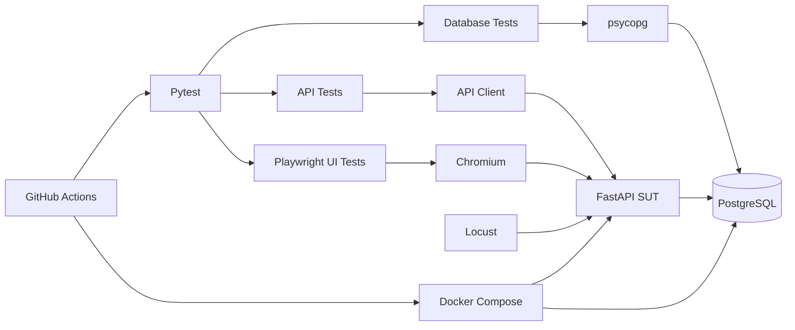
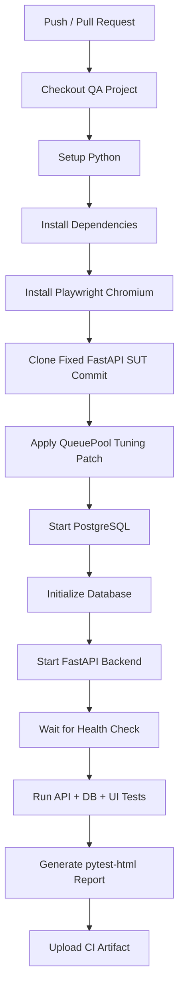

# QA Automation Testing & Performance Evaluation Platform

[](https://github.com/11166-qa/qa-automation/actions/workflows/ci.yml)

基于 **Python + Pytest + Playwright + PostgreSQL + Locust + GitHub Actions** 构建的 Web/API 自动化测试与性能评测项目，覆盖接口功能测试、数据库一致性校验、UI 端到端测试、分级性能压测、性能瓶颈定位与 CI 自动执行。

> **说明：** 本仓库是测试工程，不包含自研业务系统。被测系统（System Under Test, SUT）采用官方开源项目 [FastAPI Full Stack Template](https://github.com/fastapi/full-stack-fastapi-template)。本项目的工作重点是测试框架设计、测试用例实现、数据库校验、性能测试、性能问题定位及 CI 流程建设。

---

## 1. 项目概览

本项目围绕一个真实可运行的 FastAPI Web 系统，搭建完整的自动化测试链路：

- 使用 **Pytest** 组织 API、数据库和 UI 自动化测试；
- 封装 HTTP Client、数据库 Client 和公共 Fixture；
- 覆盖登录鉴权、Token、CRUD、边界值、异常参数、用户权限等场景；
- 使用 **psycopg** 对 PostgreSQL 数据进行直接查询，验证接口操作后的数据库一致性；
- 使用 **Playwright** 完成登录、创建、修改、删除、退出登录、未授权访问等 E2E 场景；
- 使用 **Locust** 构造查询、创建-查询和混合 CRUD 三类负载，执行 10 / 50 / 100 并发分级压测；
- 通过后端异常栈定位 **SQLAlchemy QueuePool 连接池耗尽**问题，并完成参数调优与复测；
- 使用 **GitHub Actions** 在 Ubuntu Runner 中自动安装依赖、启动 SUT、执行测试并上传 HTML 测试报告。

当前核心自动化用例共 **49 项**：

| 类型 | 用例数 | 主要覆盖内容 |
|---|---:|---|
| Authentication API | 12 | 登录成功/失败、缺失字段、Token、非法鉴权等 |
| Items API | 24 | CRUD、边界值、非法 UUID、权限、跨用户访问等 |
| Database | 4 | 创建、更新、删除、owner_id 一致性 |
| UI E2E | 9 | 登录、CRUD、退出登录、受保护路由、表单校验等 |
| **合计** | **49** | API + DB + UI |

---

## 2. 技术栈

| 类别 | 技术 |
|---|---|
| 编程语言 | Python |
| 测试框架 | Pytest |
| HTTP 测试 | requests |
| 数据库 | PostgreSQL |
| 数据库访问 | psycopg |
| UI 自动化 | Playwright |
| 性能测试 | Locust |
| 测试报告 | pytest-html |
| 容器化 | Docker / Docker Compose |
| 持续集成 | GitHub Actions |
| 被测系统 | FastAPI Full Stack Template |

---

## 3. 项目结构

```text
qa-automation/
├── .github/
│   └── workflows/
│       └── ci.yml
│
├── configs/
│   └── config.py
│
├── performance/
│   ├── analyze_results.py
│   ├── connection_pool_tuning.patch
│   ├── scenario_a_get.py
│   ├── scenario_b_post_get.py
│   ├── scenario_c_mixed.py
│   └── results/
│       ├── A_10_stats.csv
│       ├── A_50_stats.csv
│       ├── A_100_stats.csv
│       ├── B_10_stats.csv
│       ├── B_50_stats.csv
│       ├── B_100_stats.csv
│       ├── C_10_stats.csv
│       ├── C_50_stats.csv
│       ├── C_100_stats.csv
│       ├── performance_summary.csv
│       ├── performance_endpoints.csv
│       └── performance_summary.md
│
├── tests/
│   ├── api/
│   │   ├── test_auth.py
│   │   └── test_items.py
│   ├── database/
│   │   └── test_item_db.py
│   └── ui/
│       ├── test_auth_flow_ui.py
│       ├── test_items_ui.py
│       ├── test_login_ui.py
│       └── test_smoke_ui.py
│
├── utils/
│   ├── api_client.py
│   └── db_client.py
│
├── conftest.py
├── pytest.ini
├── requirements.txt
├── requirements-lock.txt
├── .gitignore
├── .gitattributes
└── README.md
```

---

## 4. 测试架构



测试工程和被测系统保持分离：

```text
qa-automation
    │
    ├── API / DB / UI / Performance / CI
    │
    └───────────────► FastAPI SUT
                         │
                         └── PostgreSQL
```

这样可以避免将被测业务代码与测试工程耦合，也便于替换 SUT 或在 CI 中重新创建测试环境。

---

## 5. 配置与公共能力

### 5.1 配置管理

`configs/config.py` 支持通过环境变量覆盖本地默认配置，例如：

```text
BASE_URL
ADMIN_EMAIL
ADMIN_PASSWORD
REQUEST_TIMEOUT

DB_HOST
DB_PORT
DB_NAME
DB_USER
DB_PASSWORD
```

默认账号仅用于本地 FastAPI 模板测试环境，不应替换为个人真实账号或生产凭据。

### 5.2 API Client

`utils/api_client.py` 对常用接口进行统一封装，包括：

- Login；
- GET Items；
- GET Item；
- POST Item；
- PUT Item；
- DELETE Item。

测试用例只关注业务输入和断言，减少重复的 URL、Header 和请求代码。

### 5.3 数据库 Client

`utils/db_client.py` 使用 `psycopg` 访问 PostgreSQL，封装：

- `fetch_one`
- `fetch_all`
- `execute`

用于从数据库层验证 API 操作是否真实落库。

### 5.4 Fixture

`conftest.py` 中通过 Fixture 管理：

- API Client；
- Admin Token / Header；
- 普通用户创建与清理；
- 测试 Item 创建与回收；
- 数据库连接；
- Playwright 登录态 Page。

通过 `yield` Fixture 实现测试前准备和测试后清理，降低测试数据相互污染。

---

## 6. API 自动化测试

### 6.1 Authentication

认证模块覆盖 12 类场景，包括：

- 正确账号密码登录；
- 错误密码；
- 不存在的用户；
- Username / Password 为空；
- Username / Password 缺失；
- 合法 Token；
- 缺失 Token；
- 非法 Bearer Token；
- 错误认证 Scheme。

测试过程中根据 FastAPI/Pydantic 的真实行为校正断言，例如缺失或非法请求字段返回 `422`，不为了“让用例变绿”而修改系统实际行为。

### 6.2 Items CRUD 与权限

Items API 覆盖 24 类场景，包括：

- Create；
- List；
- Get by ID；
- Update；
- Delete；
- 非法 UUID；
- 不存在的 ID；
- 缺失 title；
- 空 title；
- title / description 长度边界；
- 缺失 Token；
- 普通用户数据所有权；
- 管理员跨用户访问；
- 普通用户权限隔离。

---

## 7. 数据库一致性验证

仅检查 HTTP 状态码不足以证明操作真实完成，因此增加数据库层断言。

主要场景：

| 编号 | 场景 |
|---|---|
| DB-001 | POST 创建后直接查询 PostgreSQL，校验记录、字段和 owner_id |
| DB-002 | PUT 更新后查询数据库，校验 title / description |
| DB-003 | DELETE 后查询数据库，确认记录不存在 |
| DB-004 | 普通用户创建数据后校验 owner_id 与用户 ID 一致 |

形成：

```text
HTTP Request
    ↓
FastAPI
    ↓
PostgreSQL
    ↓
Direct SQL Validation
```

从接口层和数据层同时验证业务结果。

---

## 8. Playwright UI E2E

Playwright 使用 Chromium 执行浏览器端测试，覆盖：

- 页面可访问性 Smoke Test；
- 管理员登录成功；
- 错误密码登录；
- 创建 Item；
- 更新 Item；
- 删除 Item；
- Logout；
- 未登录访问受保护页面时重定向；
- 前端必填字段校验。

测试中使用：

- `get_by_test_id`
- `get_by_placeholder`
- `get_by_role`
- 局部 Row / Dialog 作用域

避免依赖容易变化或不唯一的文本定位器。

失败时可启用：

```powershell
python -m pytest tests/ui `
  --screenshot=only-on-failure `
  --tracing=retain-on-failure
```

用于保留截图和 Playwright Trace，辅助定位 UI 自动化失败原因。

---

## 9. Locust 性能测试设计

为了避免单一接口结果不能代表真实业务，设计三类负载场景。

### Scenario A：Authenticated GET

持续执行已认证列表查询：

```text
GET /api/v1/items/
```

认证 Token 在测试开始前统一获取，避免登录接口对纯查询场景产生干扰。

### Scenario B：Create + Get

业务链路：

```text
POST /api/v1/items/
        ↓
GET /api/v1/items/{id}
```

用于观察写入和随后查询的组合负载。

### Scenario C：Mixed CRUD

采用任务权重：

```text
GET  /items         5
GET  /items/{id}    2
POST /items         2
PUT  /items/{id}    1
```

即约：

```text
50%  列表查询
20%  单条查询
20%  创建
10%  更新
```

用于模拟以读为主、同时包含写操作的混合业务负载。

三类场景统一进行：

```text
10 users
50 users
100 users
```

的分级压测。

正式结果使用 Locust Headless 模式运行并通过 CSV 留档，避免依赖手工截图。

---

## 10. 正式性能测试结果

以下数据来自 `performance/results/` 中正式 Headless 测试结果。

| Scenario | Users | RPS | Avg (ms) | P95 (ms) | P99 (ms) | Failure |
|---|---:|---:|---:|---:|---:|---:|
| A - Authenticated GET | 10 | 9.80 | 13.83 | 21 | 35 | 0% |
| A - Authenticated GET | 50 | 48.98 | 20.25 | 47 | 100 | 0% |
| A - Authenticated GET | 100 | **94.61** | **59.12** | **190** | **620** | **0%** |
| B - Create + Get | 10 | 19.52 | 14.38 | 28 | 41 | 0% |
| B - Create + Get | 50 | 91.72 | 44.56 | 120 | 270 | 0% |
| B - Create + Get | 100 | **118.85** | **337.66** | **530** | **790** | **0%** |
| C - Mixed CRUD | 10 | 9.72 | 16.45 | 29 | 34 | 0% |
| C - Mixed CRUD | 50 | 48.68 | 21.13 | 47 | 120 | 0% |
| C - Mixed CRUD | 100 | **88.31** | **130.84** | **420** | **910** | **0%** |

### 结果观察

- Scenario A 从 10 到 50 并发基本保持线性吞吐增长；
- 100 并发下纯查询场景仍保持 **P95 = 190 ms、失败率 0%**；
- Scenario B/C 在 100 并发下出现更明显的尾延迟，说明写操作和数据库访问逐渐成为主要开销；
- 三类正式测试在 10 / 50 / 100 并发下均保持 **0% 请求失败率**；
- 100 并发混合 CRUD 场景达到 **88.31 RPS，P95 = 420 ms**。

> 本结果来自单机 Windows + Docker Desktop 本地测试环境，仅用于该项目中的相对性能分析和瓶颈定位，不代表 FastAPI、PostgreSQL 或生产环境的通用性能上限。

详细接口数据：

```text
performance/results/performance_endpoints.csv
```

总体汇总：

```text
performance/results/performance_summary.csv
performance/results/performance_summary.md
```

---

## 11. SQLAlchemy QueuePool 性能瓶颈定位与优化

### 11.1 问题发现

在 Scenario B 的早期 100 并发测试中，系统出现大量 HTTP 500：

```text
POST /items   → HTTP 500
GET /items/id → HTTP 500
```

该轮测试失败率约 **64%**，同时响应时间出现 30 s、60 s、90 s 等明显长等待。

### 11.2 后端日志定位

检查 FastAPI / SQLAlchemy 后端日志后发现：

```text
sqlalchemy.exc.TimeoutError:
QueuePool limit of size 5 overflow 10 reached,
connection timed out, timeout 30.00
```

问题发生在受保护接口鉴权过程中：

```text
get_current_user
    ↓
session.get(User, ...)
    ↓
等待数据库连接
    ↓
QueuePool exhausted
```

这说明问题并非 Locust 客户端超时，而是后端 SQLAlchemy 数据库连接池耗尽。

### 11.3 原始配置

SQLAlchemy Engine 原始配置：

```python
engine = create_engine(
    str(settings.DATABASE_URL),
    pool_pre_ping=True,
)
```

运行时默认连接池表现为：

```text
pool_size      = 5
max_overflow   = 10
```

即大约最多 15 个同时借出的连接。

PostgreSQL：

```text
max_connections = 100
```

### 11.4 参数优化

在不直接将连接池扩大到数据库最大连接数的前提下，进行保守调优：

```python
engine = create_engine(
    str(settings.DATABASE_URL),
    pool_pre_ping=True,
    pool_size=20,
    max_overflow=20,
    pool_timeout=30,
)
```

即最大可借连接规模约为 40，并为 PostgreSQL 预留连接余量。

修改以 Patch 形式保存在：

```text
performance/connection_pool_tuning.patch
```

GitHub Actions 在启动 SUT 前自动应用该 Patch。

### 11.5 优化结果

同类 100 并发 Create + Get 负载下：

| 指标 | 优化前探索性测试 | 优化后 |
|---|---:|---:|
| Failure Rate | ≈64% | **0%** |
| Avg Response | ≈58.6 s | **约0.34 s** |
| P95 | ≈90 s | **约0.53 s** |
| P99 | ≈119 s | **约0.79 s** |

优化后正式 B-100 结果：

```text
RPS      = 118.85
Avg      = 337.66 ms
P95      = 530 ms
P99      = 790 ms
Failures = 0%
```

该过程形成完整的性能问题闭环：

```text
高并发压测
    ↓
HTTP 500
    ↓
Locust Failure 分类
    ↓
FastAPI / SQLAlchemy 异常栈
    ↓
QueuePool timeout
    ↓
连接池参数分析
    ↓
参数调整
    ↓
相同负载复测
    ↓
Failure ≈64% → 0%
```

---

## 12. 性能结果自动汇总

`performance/analyze_results.py` 自动读取 9 组 Locust `_stats.csv`：

```text
A_10 / A_50 / A_100
B_10 / B_50 / B_100
C_10 / C_50 / C_100
```

自动生成：

```text
performance_summary.csv
performance_endpoints.csv
performance_summary.md
```

执行：

```powershell
python performance/analyze_results.py
```

输出字段包括：

```text
Scenario
Concurrency
Request Count
Failure Count
Failure Rate
RPS
Average
Median
P95
P99
Max
```

避免人工复制性能数据带来的统计错误。

---

## 13. GitHub Actions CI

项目已配置：

```text
.github/workflows/ci.yml
```

在 Push / Pull Request 时自动执行测试。

CI 流程：



CI 主要能力：

- Ubuntu Runner 自动创建干净环境；
- 安装跨平台测试依赖；
- 安装 Playwright Chromium；
- 克隆并 Checkout 固定版本的 FastAPI SUT；
- 自动应用性能优化 Patch；
- Docker Compose 启动 PostgreSQL / FastAPI；
- 自动执行 API + Database + UI 测试；
- 失败时打印 Backend / Database Docker Logs；
- 通过 `pytest-html` 生成 HTML 测试报告；
- 将测试报告上传为 GitHub Actions Artifact；
- 流程结束后自动清理 Docker 环境。

CI 状态可直接通过仓库顶部 Badge 查看。

---

## 14. 本地运行

### 14.1 克隆测试项目

```bash
git clone https://github.com/11166-qa/qa-automation.git
cd qa-automation
```

### 14.2 创建虚拟环境

Windows：

```powershell
python -m venv .venv
.\.venv\Scripts\Activate.ps1
```

安装依赖：

```powershell
python -m pip install --upgrade pip
pip install -r requirements.txt
```

安装 Playwright Chromium：

```powershell
python -m playwright install chromium
```

### 14.3 启动 SUT

测试工程默认假设 FastAPI SUT 运行于：

```text
http://localhost:8000
```

本项目 CI 会自动克隆固定 Commit 的官方 FastAPI Full Stack Template。

本地也可自行克隆：

```bash
git clone https://github.com/fastapi/full-stack-fastapi-template.git
```

具体 SUT Commit 以 `.github/workflows/ci.yml` 中固定版本为准。

启动 Docker 环境后，根据模板版本完成数据库初始化，并确保：

```text
http://localhost:8000
```

可以访问。

### 14.4 执行 API 测试

```powershell
python -m pytest tests/api -v
```

### 14.5 执行数据库测试

```powershell
python -m pytest tests/database -v
```

### 14.6 执行 UI 测试

```powershell
python -m pytest tests/ui -v
```

### 14.7 全量功能测试

```powershell
python -m pytest tests/api tests/database tests/ui -q
```

### 14.8 生成 HTML Report

```powershell
python -m pytest tests/api tests/database tests/ui `
  --html=reports/test_report.html `
  --self-contained-html
```

---

## 15. Locust 运行示例

### Scenario A

```powershell
locust -f performance/scenario_a_get.py `
  --host http://localhost:8000
```

### Scenario B

```powershell
locust -f performance/scenario_b_post_get.py `
  --host http://localhost:8000
```

### Scenario C

```powershell
locust -f performance/scenario_c_mixed.py `
  --host http://localhost:8000
```

正式 Headless 100 并发示例：

```powershell
locust -f performance/scenario_c_mixed.py `
  --host http://localhost:8000 `
  --headless `
  -u 100 `
  -r 20 `
  -t 125s `
  --reset-stats `
  --csv performance/results/C_100
```

---

## 16. 项目亮点

1. **测试层次完整**  
   不只做接口状态码校验，而是覆盖 API、数据库和浏览器 E2E 三个层次。

2. **Fixture 与 Client 封装**  
   通过公共 Fixture、API Client 和 DB Client 降低重复代码，并实现测试数据自动准备与清理。

3. **权限与异常场景覆盖**  
   包含正常路径、非法输入、边界值、Token、普通用户与管理员权限差异。

4. **真实性能问题定位**  
   不是只输出 RPS/P95，而是通过 Locust + 后端日志定位 SQLAlchemy QueuePool 耗尽问题。

5. **完成优化复测闭环**  
   连接池调优后将 100 并发 Create + Get 场景失败率由约 64% 降至 0%。

6. **性能实验可留档、可分析**  
   9 组正式测试全部以 CSV 保存，并由脚本自动生成汇总结果。

7. **CI 自动执行**  
   GitHub Actions 可从零创建测试环境，启动 SUT，执行 API / DB / UI 自动化测试并上传报告。

---

## 17. 项目成果

本项目最终形成：

- 49 项 API / Database / UI 核心自动化测试；
- 3 类 Locust 性能场景；
- 10 / 50 / 100 三档并发测试；
- 9 组正式性能 CSV；
- 自动化性能结果汇总脚本；
- SQLAlchemy QueuePool 性能瓶颈定位与优化记录；
- Playwright 浏览器 E2E 测试；
- pytest-html 测试报告；
- GitHub Actions CI 流程；
- 可复现的 SUT 固定版本 + Connection Pool Patch 机制。

---

## 18. Resume-ready Summary

**Python Web/API 自动化测试与性能评测平台**

- 基于 Pytest 构建 API 自动化测试框架，封装 Fixture、HTTP Client 和数据库访问组件，覆盖登录鉴权、CRUD、异常参数、边界值和用户权限等场景，并通过 PostgreSQL 直连校验接口操作后的数据一致性；
- 使用 Playwright 实现登录、CRUD、退出登录、权限跳转和表单校验等 Web E2E 测试，通过 pytest-html 生成自动化测试报告；
- 基于 Locust 设计查询、创建-查询和 5:2:2:1 混合 CRUD 三类负载，完成 10/50/100 并发分级压测，正式测试各场景失败率均为 0%，100 并发查询场景 P95 为 190 ms，混合业务 P95 为 420 ms；
- 结合 Locust Failure 与 FastAPI/SQLAlchemy 日志定位 QueuePool 连接池耗尽问题，通过连接池参数优化将 100 并发创建-查询场景失败率由约 64% 降至 0%；
- 使用 GitHub Actions 搭建 CI 流程，自动安装测试环境、启动固定版本 SUT、执行 API/数据库/UI 测试并上传 HTML 测试报告。

---

## 19. Notes

- 本项目仅用于软件测试、自动化测试及性能工程实践；
- FastAPI Full Stack Template 为第三方开源被测系统，不属于本项目自行开发的业务系统；
- 性能结果与本机硬件、Docker Desktop、数据库状态、测试时长及并发模型有关，应作为当前测试环境下的实验结果理解；
- 仓库中不应提交个人真实密码、Token、API Key 或生产环境敏感信息。
